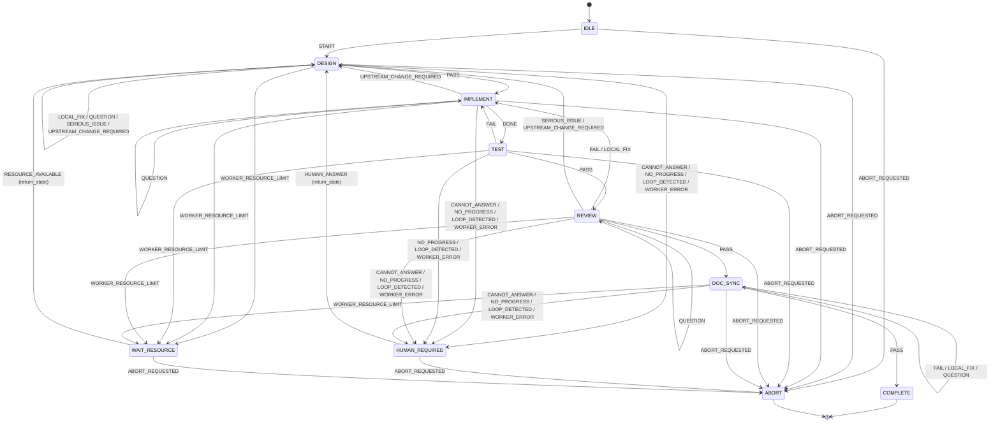

# 実施結果 001

対象指示書: `instructions/instruction-2026-08-08-001.md`

> 置き場所について: 指示書は `result-2026-08-08-001.md` とだけ指定しており、
> ディレクトリを決めていなかった。指示書の隣に置く方が対応関係を追いやすいため
> `instructions/` 配下とした。

---

## 実施内容

指示書 §17「最初の実装順」のうち **1〜5 を実装した**。

| # | 項目 | 状態 |
|---|------|------|
| 1 | プロジェクト骨格 | 完了 |
| 2 | Pydantic の State / Event / ArtifactStatus モデル | 完了 |
| 3 | SQLite 永続化 | 完了 |
| 4 | State Transition Logger | 完了 |
| 5 | 小さい Main Graph | 完了 |
| 6〜16 | DocumentStage Subgraph 以降 | 未着手 |

指示書 §16「過度な抽象化を避ける」に従い、モジュールは 5 本のフラット構成にした。
Worker interface、adapter、plugin registry の類は作っていない（§17-11 の作業）。

### 設計上の中心的な判断

**遷移表が成果物で、LangGraph は入れ物にすぎない。**

指示書 §7 の

```text
current_state + event -> next_state
```

を `transitions.py` の `TRANSITIONS: dict[tuple[State, Event], State]` として持ち、
LangGraph にも AI Worker にも SQLite にも依存させなかった。
Controller の正しさは `next_state()` だけで検証できる（`tests/test_transitions.py` は
LangGraph を import しない）。graph の node は遷移表を引くだけで、判断を持たない。

---

## 実装した State / Substate / Event

### トップレベル State（指示書 §1 のとおり 10 個）

```text
IDLE  DESIGN  IMPLEMENT  TEST  REVIEW  DOC_SYNC
COMPLETE  HUMAN_REQUIRED  WAIT_RESOURCE  ABORT
```

`SPEC_CREATE` / `USECASE_CREATE` 等はトップレベルに置いていない。

### Substate / Phase（値のみ定義。Subgraph 本体は §17-6）

```text
DocumentStage: SPEC  USECASE  SEQUENCE  CLASS  UI  TESTCASE
Phase:         GENERATE  REVIEW  FIX  COMPLETE
ReviewLevel:   LIGHT  DEEP
```

### ArtifactStatus / ArtifactKind（指示書 §6）

```text
ArtifactStatus: VALID  REVIEW_REQUIRED  STALE
ArtifactKind:   SPEC USECASE SEQUENCE CLASS UI TESTCASE CODE README
```

### Event

指示書に名前が出ているもの:

```text
DONE  PASS  FAIL  LOCAL_FIX  QUESTION  SERIOUS_ISSUE
UPSTREAM_CHANGE_REQUIRED  WORKER_ERROR  WORKER_RESOURCE_LIMIT
NO_PROGRESS  LOOP_DETECTED  CANNOT_ANSWER
```

**指示書に無く、こちらで補った Event（要確認）:**

```text
START               IDLE を出るため
HUMAN_ANSWER        HUMAN_REQUIRED から復帰するため
RESOURCE_AVAILABLE  WAIT_RESOURCE から復帰するため
ABORT_REQUESTED     ABORT へ入るため
```

これが無いと IDLE / WAIT_RESOURCE / HUMAN_REQUIRED / ABORT が到達不能または
脱出不能になるため足した。名前を変えたい場合はここだけ直せばよい。

---

## 実装後の State Machine



`HUMAN_REQUIRED` / `WAIT_RESOURCE` からの復帰先は静的に決まらないため、図では
DESIGN へ描いているが、実際には `RunState.return_state` に保存した State へ戻る。
遷移表では `RESUME` マーカーで表現している。

DESIGN の自己ループは、§17-6 で DocumentStage Subgraph に置き換わり
トップレベルからは消える予定の暫定表現である。

---

## 追加・変更ファイル

```text
pyproject.toml                            新規  Python 3.12+ / langgraph / pydantic / pytest
uv.lock                                   新規  解決済みバージョンを固定
.gitignore                                新規
README.md                                 新規
src/agent_controller/__init__.py          新規  公開 API
src/agent_controller/models.py            新規  §17-2  State / Event / ArtifactStatus など
src/agent_controller/transitions.py       新規  遷移表 + apply_event（Controller の中核）
src/agent_controller/store.py             新規  §17-3  SQLite 永続化
src/agent_controller/transition_log.py    新規  §17-4  遷移の記録とレンダリング
src/agent_controller/graph.py             新規  §17-5  小さい Main Graph
tests/conftest.py                         新規
tests/test_transitions.py                 新規  遷移表（LangGraph / SQLite 非依存）
tests/test_store.py                       新規  永続化
tests/test_transition_log.py              新規  §10 表示形式
tests/test_graph.py                       新規  E2E 受け入れ
instructions/result-2026-08-08-001.md     新規  本ファイル
```

解決済みバージョン: Python 3.12.10 / langgraph 1.2.10 / pydantic 2.13.4 / pytest 9.1.1

---

## テスト結果

```text
$ uv run pytest -q
............................................                             [100%]
44 passed in 2.69s
```

内訳:

- `test_transitions.py` — 遷移表、RESUME、retry_count、status
- `test_store.py` — runs / transitions / artifacts の round trip、ファイル再オープン
- `test_transition_log.py` — 指示書 §10 の表示例の再現、ログからの手戻り追跡
- `test_graph.py` — E2E

---

## E2E 実行結果

指示書「最初の実証」のうち、AI Worker を必要としない範囲を stub handler で確認した。

| 確認項目 | 結果 |
|---|---|
| happy path `IDLE → DESIGN → IMPLEMENT → TEST → REVIEW → DOC_SYNC → COMPLETE` | PASS |
| 分岐 `TEST FAIL → IMPLEMENT → TEST` を経て COMPLETE | PASS |
| `CANNOT_ANSWER` で HUMAN_REQUIRED に停止し、return_state が保存される | PASS |
| `WORKER_RESOURCE_LIMIT` で WAIT_RESOURCE に停止する | PASS |
| 停止した run を Worker を替えて同じ State から再開し COMPLETE まで到達する | PASS |
| 遷移行と最終 run が SQLite に残る | PASS |
| 遷移ログから「どの State で、どの Event により、どこへ戻ったか」を追える | PASS |

graph の入口も遷移表に従わせたため、`WAIT_RESOURCE` で止めた run を再開すると
IDLE からやり直さず、止まった State の node へ直接入る。

---

## 状態遷移ログ例

`DESIGN` の局所修正 1 回と `TEST` 失敗 1 回を含む run の実出力（UTC 表示）:

```text
11:10:36 | IDLE | START
         -> DESIGN | role=CONTROLLER | checkpoint=533abed
11:10:36 | DESIGN | LOCAL_FIX
         -> DESIGN | worker=CODEX_CLI | role=REVIEWER | retry=1 | checkpoint=533abed | reason=class naming mismatch
11:10:36 | DESIGN | PASS
         -> IMPLEMENT | worker=CODEX_CLI | role=REVIEWER | checkpoint=533abed
11:10:36 | IMPLEMENT | DONE
         -> TEST | worker=CLAUDE_CODE | role=IMPLEMENTER | checkpoint=533abed
11:10:36 | TEST | FAIL
         -> IMPLEMENT | worker=CLAUDE_CODE | role=CONTROLLER | checkpoint=533abed | reason=1 failing test
11:10:36 | IMPLEMENT | DONE
         -> TEST | worker=CLAUDE_CODE | role=IMPLEMENTER | checkpoint=533abed
11:10:36 | TEST | PASS
         -> REVIEW | worker=CLAUDE_CODE | role=CONTROLLER | checkpoint=533abed
11:10:36 | REVIEW | PASS
         -> DOC_SYNC | worker=CODEX_CLI | role=REVIEWER | checkpoint=533abed
11:10:36 | DOC_SYNC | PASS
         -> COMPLETE | worker=CLAUDE_CODE | role=DIRECTOR | checkpoint=533abed
```

SQLite の `transitions` 行が正本で、このテキストは行から生成する純関数
（`render_log`）で作っている。

---

## 未実装事項 / 制約

### 指示書の範囲で未着手（§17-6 以降）

- DocumentStage Subgraph（共通化された GENERATE → REVIEW → FIX）
- DESIGN の Progressive Refinement（SPEC → … → TESTCASE の実際の進行）
- LIGHT / DEEP review routing。`ReviewLevel` は値だけあり、昇格ロジックは無い
- retry / loop guard。`retry_count` は数えているが**上限判定は無い**
- IMPACT_ANALYSIS。`ArtifactStatus` と `artifacts` テーブルはあるが判定処理は無い
- Worker interface と Claude Code / Codex CLI adapter。今は stub のみで AI を呼ばない
- QandA.md ループ。`QUESTION` は現状 State 内の自己ループで表現しているだけ
- Git checkpoint / rollback / Worker fallback。`checkpoint_commit` は記録するだけで、
  実際に commit も rollback もしない
- README / COMPLETE gate。COMPLETE は `DOC_SYNC + PASS` で入るだけで、
  §15 の完了条件は検査していない
- AntiGravity / Grok

### 判明した制約・注意点

1. **`to_phase` を 1 項目足した。** 指示書 §10 の項目一覧は 15 個だが、同じ §10 の
   表示例 `-> DESIGN/CLASS/FIX` は遷移先の phase を含んでおり、15 項目では再現できない。
   §17-6 での schema 変更を避けるため先に足した。
2. **`state` と `from_state` は現状つねに同じ値。** §10 が両方を挙げているため両方
   持っているが、`state/substate/phase` は「遷移を評価した位置」、`from_state/from_substate`
   は「遷移元」という意味付けにしている。
3. **無限ループを止めるのは今のところ LangGraph の `recursion_limit`（既定 100）だけ。**
   工程としての loop guard は §17-9。それまでは stub が同じ Event を返し続けると
   recursion_limit で落ちる。
4. **`substate` / `phase` は常に None。** DocumentStage Subgraph が無いため。
   カラムと型は先に用意してあるので、§17-6 で schema 変更は要らない。
5. `Store` は 1 接続の薄いラッパーで、並行アクセスは考慮していない。

---

## 次に行うべき作業

1. **§17-6 共通 DocumentStage Subgraph。** ここが「トップレベル State を増やさない」
   という指示書の中心的な制約を実際に守れるかの試金石になる。`DocumentStage(name=..., inputs=...,
   review_level=..., max_review_retry=...)` の設定値で振る舞いを変える形にする。
2. §17-7 DESIGN の Progressive Refinement を Subgraph の上に載せる。
3. §17-8 LIGHT / DEEP routing。§5 の初期値（SPEC/USECASE のみ DEEP）を設定として置く。
4. §17-9 loop guard。`retry_count` は既にあるので上限判定と `NO_PROGRESS` fingerprint を足す。

補った Event 名（`START` / `HUMAN_ANSWER` / `RESOURCE_AVAILABLE` / `ABORT_REQUESTED`）に
希望があれば、`models.Event` と `transitions.TRANSITIONS` を直せば済む。

---

## Git

作業コミット:

```text
a1c22fc  Implement controller core: models, transition table, SQLite store, logger, main graph
```

本ファイルのコミット SHA は下の `git status --short` 確認と同時に追記する
（結果ファイル自身のコミットのため後追いになる）。

最終確認:

```text
$ git status --short
(空 / clean)
```
