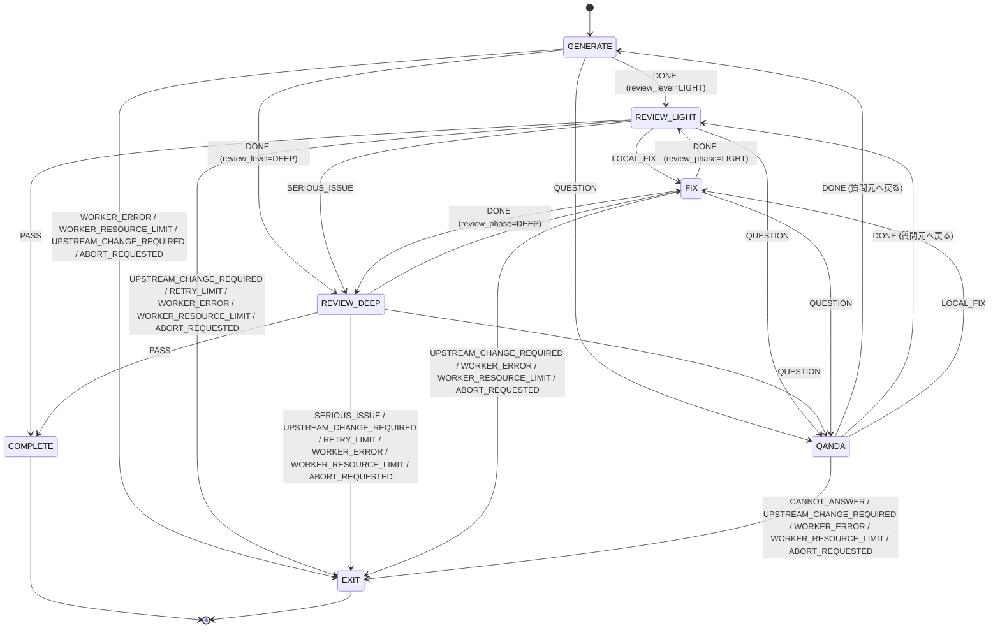

# 実施結果 002

対象: `instructions/instruction-2026-08-08-001.md` §17-6「共通 DocumentStage Subgraph」

> この作業に対応する指示書ファイルは無い。`result-2026-08-08-001.md` へのレビューを受けた
> チャット上の承認（「§17-1〜5 完了として先へ進めてよい」）を根拠に実施した。
> そこで示された phase 構成・Event 名の判断は、後から辿れるよう本ファイルに写してある。

---

## 実施内容

§17-6 を実装した。**トップレベル State は 1 つも増えていない**（10 個のまま）。

stage の中の往復はすべて substate / phase で回る。

```text
DESIGN/CLASS/REVIEW_LIGHT
  -- LOCAL_FIX -->
DESIGN/CLASS/FIX
```

`§17-7`（DESIGN の Progressive Refinement = SPEC → … → TESTCASE の実際の進行）には
入っていない。この chunk の Subgraph は単体で完結し、Main Graph には未接続。

### 設計上の中心的な判断

**stage の中の遷移をトップレベルの遷移表に通さないこと。**

stage の `PASS` は「この文書が通った」であって「DESIGN が終わった」ではない。
両方を同じ表で引くと `DESIGN + PASS -> IMPLEMENT` に化けて、SPEC を 1 つ通しただけで
設計工程全体が終わったことになってしまう。

そこで表を 2 段にした。

| 表 | 場所 | 引くもの |
|---|---|---|
| `TRANSITIONS` | `transitions.py` | `(State, Event) -> State` |
| `STAGE_TRANSITIONS` | `document_stage.py` | `(Phase, Event) -> Phase \| EXIT \| 動的マーカー` |

stage を**抜ける** Event（`EXIT`）だけがトップレベルの表へ渡る。
どちらも純 Python の dict で、LangGraph にも AI Worker にも依存しない。

動的マーカーは 2 つ。

```text
ENTER_REVIEW     その stage で有効なレビュー強度（review_phase）へ入る
RESUME_QUESTION  QANDA へ入る前の phase へ戻る
```

これにより FIX は「指摘を出したレビュー強度」へ、QANDA は「質問した phase」へ、
それぞれ正しく戻る。QANDA が FIX からもレビューからも呼べる入れ子構造が壊れない。

---

## チャットで確定した判断の記録

| 論点 | 決定 | 理由 |
|---|---|---|
| `START` / `HUMAN_ANSWER` / `RESOURCE_AVAILABLE` / `ABORT_REQUESTED` | **採用** | IDLE・HUMAN_REQUIRED・WAIT_RESOURCE・終了要求を状態遷移として扱う以上、暗黙処理にせず正式な Event にする |
| `ABORT_REQUESTED` と ERROR 系の分離 | **維持** | 終了要求は AI Worker の失敗ではない。同じ Event にまとめない |
| 遷移ログの phase 情報 | **採用** | `DESIGN -> DESIGN` ではなく `DESIGN/CLASS/REVIEW -> DESIGN/CLASS/FIX` が人間の見たい形 |
| `from_state` / `from_substate` / `from_phase` の対称性 | **property による別名**（schema 変更なし） | §10 の項目一覧では `state/substate/phase` が遷移元を指す。カラムを増やさずに読み手側の対称性だけ確保する |
| `Phase` の分割 | **`GENERATE` / `REVIEW_LIGHT` / `REVIEW_DEEP` / `FIX` / `QANDA` / `COMPLETE`** | §4 の FAST PATH / DEEP PATH を phase として素直に表す |
| `RETRY_LIMIT` と `NO_PROGRESS` | **別 Event として分離** | RETRY_LIMIT は回数の超過、NO_PROGRESS は同じ失敗の繰り返し（fingerprint）。判定材料が違う |
| `LOCAL_FIX` と `REQUEST_CHANGES` | **`LOCAL_FIX` を維持** | チャットの `REQUEST_CHANGES` は説明用の書き方と解釈した。指示書 §2 / §3 / §4 は `LOCAL_FIX` |
| `recursion_limit` の位置付け | **最後の非常停止装置** | ループ防止機構そのものではない。§17-9 で Controller 側に持たせる |

### §10 の表示例との差

指示書 §10 の例は phase を単に `REVIEW` と書いている（`DESIGN/CLASS/REVIEW`）。
LIGHT / DEEP を phase に分けたため、実際の出力は `DESIGN/CLASS/REVIEW_LIGHT` になる。
書式そのものは変えていない。指示書 §「既存 memo.md について」の「より新しい方針を優先する」に従う。

---

## 実装した Phase / 遷移

### Phase

```text
GENERATE  REVIEW_LIGHT  REVIEW_DEEP  FIX  QANDA  COMPLETE
```

### DocumentStage Subgraph



`EXIT` は phase ではなく、「Event をトップレベルの遷移表へ渡して stage を抜ける」印。
図では終端として描いている。

`REVIEW_DEEP + SERIOUS_ISSUE` が EXIT なのは、DEEP で見てなお重大なら、それは
この stage の問題ではなく上位工程の問題だという判断による（§4）。

### 設定値（指示書 §3 の例をそのまま）

```python
DocumentStageConfig(
    name=DocumentStage.CLASS,
    inputs=["SEQUENCE.md", "SPEC.md"],
    output="CLASS.md",
    review_level=ReviewLevel.LIGHT,
    max_review_retry=2,
)
```

`review_level` は「その stage で最初に入る review phase」を決める。
§5 の初期値（SPEC / USECASE のみ DEEP）は `DEFAULT_REVIEW_LEVELS` に置いた。
stage ごとの状態機械は書いていない。設定値だけで振る舞いが変わる。

---

## 追加・変更ファイル

```text
src/agent_controller/document_stage.py   新規  §17-6 本体
src/agent_controller/models.py           変更  Phase 分割 / RETRY_LIMIT / ReviewLevel.phase /
                                               DEFAULT_REVIEW_LEVELS / from_phase property /
                                               question_source_phase・review_phase・review_retry_count
src/agent_controller/transitions.py      変更  (各 State, RETRY_LIMIT) -> HUMAN_REQUIRED を追加
src/agent_controller/store.py            変更  runs に question_source_phase / review_phase /
                                               review_retry_count を追加
src/agent_controller/transition_log.py   変更  persist() を追加（phase 遷移の記録用）
src/agent_controller/__init__.py         変更  公開 API
tests/test_document_stage.py             新規  §17-6 の受け入れテスト
tests/test_transition_log.py             変更  Phase.REVIEW -> REVIEW_LIGHT / from_phase テスト追加
tests/test_store.py                      変更  Phase.REVIEW -> REVIEW_LIGHT
instructions/result-2026-08-08-002.md    新規  本ファイル
```

---

## テスト結果

```text
$ uv run pytest -q
........................................................................ [100%]
72 passed in 0.85s
```

前回 44 → 今回 72（+28）。

`tests/test_document_stage.py` の各テストは `run.current_state` が `DESIGN` のまま
であることを併せて確認している。この chunk の合否はそこで決まるため。

---

## E2E 実行結果

| 確認項目 | 結果 |
|---|---|
| FAST PATH `GENERATE → REVIEW_LIGHT → PASS → COMPLETE` | PASS |
| `REVIEW_LIGHT → LOCAL_FIX → FIX → REVIEW_LIGHT → PASS → COMPLETE`（§3 の図） | PASS |
| `review_level=DEEP` の stage は最初から REVIEW_DEEP に入る（§5） | PASS |
| `SERIOUS_ISSUE` で LIGHT → DEEP に昇格し、以後その stage は DEEP で回る | PASS |
| `QUESTION → QANDA → DONE` で**質問した phase**へ戻る（GENERATE 発・REVIEW 発の両方） | PASS |
| QANDA の回答が修正を要する場合 `QANDA → FIX → REVIEW` | PASS |
| `CANNOT_ANSWER` で stage を抜けて HUMAN_REQUIRED（return_state=DESIGN） | PASS |
| `UPSTREAM_CHANGE_REQUIRED` がトップレベル表へ伝播し phase が外れる | PASS |
| `WORKER_RESOURCE_LIMIT` で WAIT_RESOURCE、substate は保持 | PASS |
| `max_review_retry` 超過で `RETRY_LIMIT` → HUMAN_REQUIRED（`NO_PROGRESS` は出ない） | PASS |
| `max_review_retry` を stage ごとに変えられる | PASS |
| 往復中、トップレベル State が `DESIGN` から動かない | PASS |
| phase の途中で止まった run を、その phase から再開する | PASS |

---

## 状態遷移ログ例

CLASS stage で局所修正 1 回・質問 1 回・DEEP 昇格 1 回が起きた実出力（UTC 表示）:

```text
14:33:16 | DESIGN/CLASS/GENERATE | DONE
         -> DESIGN/CLASS/REVIEW_LIGHT | worker=CLAUDE_CODE | role=IMPLEMENTER | checkpoint=a1c22fc
14:33:16 | DESIGN/CLASS/REVIEW_LIGHT | LOCAL_FIX
         -> DESIGN/CLASS/FIX | worker=CODEX_CLI | role=REVIEWER | checkpoint=a1c22fc | reason=class naming mismatch
14:33:16 | DESIGN/CLASS/FIX | DONE
         -> DESIGN/CLASS/REVIEW_LIGHT | worker=CLAUDE_CODE | role=IMPLEMENTER | retry=1 | checkpoint=a1c22fc
14:33:16 | DESIGN/CLASS/REVIEW_LIGHT | QUESTION
         -> DESIGN/CLASS/QANDA | worker=CODEX_CLI | role=REVIEWER | retry=1 | checkpoint=a1c22fc | reason=retry policy unspecified
14:33:16 | DESIGN/CLASS/QANDA | DONE
         -> DESIGN/CLASS/REVIEW_LIGHT | worker=CLAUDE_CODE | role=DIRECTOR | retry=1 | checkpoint=a1c22fc | reason=answered from SPEC.md
14:33:16 | DESIGN/CLASS/REVIEW_LIGHT | SERIOUS_ISSUE
         -> DESIGN/CLASS/REVIEW_DEEP | worker=CODEX_CLI | role=REVIEWER | retry=1 | checkpoint=a1c22fc | reason=sequence responsibility mismatch
14:33:16 | DESIGN/CLASS/REVIEW_DEEP | PASS
         -> DESIGN/CLASS/COMPLETE | worker=CODEX_CLI | role=REVIEWER | retry=1 | checkpoint=a1c22fc
```

7 遷移すべてで `to_state` は `DESIGN` のまま。トップレベルからは
「DESIGN にいる」以上のことは起きていない。

`retry=` は stage 内の `review_retry_count`（FIX からレビューへ戻った回数）を表示している。

---

## 未実装事項 / 制約

### 次の chunk 以降

- **§17-7 Progressive Refinement** — Subgraph は単体で動くが、Main Graph に未接続。
  SPEC → USECASE → … → TESTCASE を順に回し、全 stage 通過で `DESIGN + PASS` を出す
  部分が無い。`DOCUMENT_STAGE_ORDER` は用意済み。
- **§17-8 LIGHT / DEEP routing** — 設定値による初期強度と `SERIOUS_ISSUE` による昇格は
  実装したが、`DEFAULT_REVIEW_LEVELS` を stage 定義へ自動適用する配線は無い。
- **§17-9 loop guard** — `max_review_retry` による `RETRY_LIMIT` だけ実装した。
  `same_transition_count`、`no_progress_fingerprint`、1 run の最大 transition 数、
  Worker を替えても同一失敗、は未実装。
- §17-10 以降（IMPACT_ANALYSIS、Worker interface、adapter、QandA.md 実体、
  Git checkpoint / rollback、README / COMPLETE gate）は 001 から変わらず未着手。

### 制約・注意点

1. **`QandA.md` というファイルはまだ無い。** `QANDA` phase は状態としてだけ存在し、
   質問の記録・回答・`Question ID` 等（§9）は持っていない。§17-13 の作業。
2. **stage を EXIT で抜けると `phase` が失われる。** `substate` は残るので「どの文書で
   止まったか」は分かるが、再開時は `GENERATE` からやり直しになる。
   phase 単位の再開が要るなら `return_phase` を足す必要がある。
   一方、`WAIT_RESOURCE` を経ずに stage 内で止まった run は、その phase から再開する。
3. **`review_phase` の DEEP 昇格は stage 内でのみ有効。** 次の stage に入ると
   `start_stage` が `review_level` の初期値へ戻す。stage をまたいで DEEP を維持したい
   場合は別途仕様が要る。
4. `RETRY_LIMIT` は「FIX からレビューへ戻った回数」だけを数える。
   GENERATE や QANDA の往復は数えていない。
5. `recursion_limit`（既定 100）は依然として最後の非常停止装置。

---

## 次に行うべき作業

1. **§17-7 Progressive Refinement。** `DOCUMENT_STAGE_ORDER` に沿って Subgraph を
   繰り返し呼び、全 stage 通過で `DESIGN + PASS -> IMPLEMENT` を出す。
   ここまで通れば、指示書 §2 の段階的詳細化が State Machine として成立したことになる。
2. §17-8 の配線（`DEFAULT_REVIEW_LEVELS` を stage 定義に適用）。1 と同時でよい。
3. §17-9 loop guard。stage を何本か回すとループの形が見えるので、その後が実装しやすい。

---

## Git

```text
a1c22fc  Implement controller core: models, transition table, SQLite store, logger, main graph
ef71f04  docs: add result-2026-08-08-001 for instruction 001 steps 1-5
e12ae20  docs: record final commit SHAs in result-2026-08-08-001
7083803  Implement common DocumentStage subgraph (§17-6)
```

本ファイル自身の SHA 追記分だけ、さらに 1 コミット後ろにずれる。amend は使っていない。

最終確認:

```text
$ uv run pytest -q
........................................................................ [100%]
72 passed in 0.85s

$ git status --short
(出力なし = clean)
```
