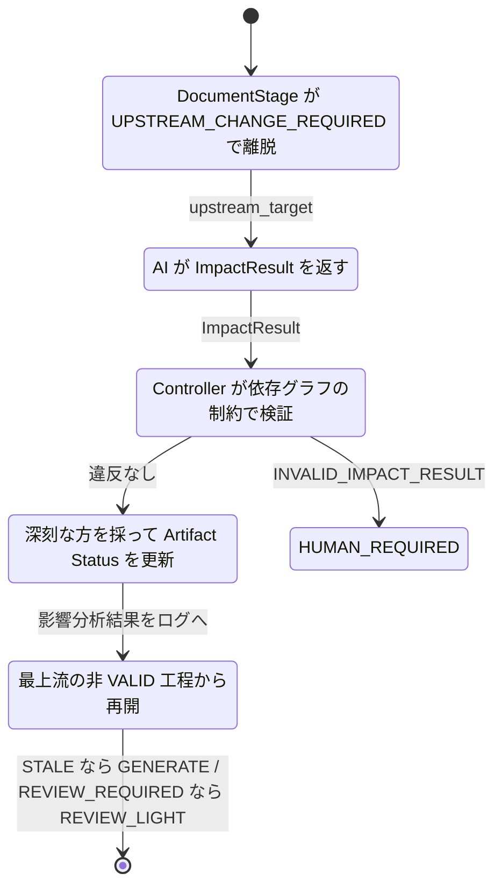

# 実施結果 005

対象: `instructions/instruction-2026-08-08-001.md` §17-10「IMPACT_ANALYSIS」（§6）

> 対応する指示書ファイルは無い。`result-2026-08-09-004.md` へのレビューを受けた
> チャット上の指示（`ImpactResult` の形、Controller 側の 3 値処理、
> `INVALID_IMPACT_RESULT` による拒否）に基づく。

---

## 実施内容

「AI が意味を判断し、Controller は構造化された結果だけを検証・適用する」という
境界をそのまま実装した。

```text
Reviewer / Director / Analyzer
        ↓
   ImpactResult          自由文ではなく構造化された提案
        ↓
Controller が妥当性検証   依存グラフの制約を破らせない
        ↓
Artifact Status 更新     深刻な方を採る（良い方へは倒さない）
        ↓
必要な DocumentStage だけ再実行
```

Controller が扱うのは 3 値だけで、文章は一切解釈しない。

```text
STALE            再生成必須            → GENERATE から入る
REVIEW_REQUIRED  軽量レビューのみ      → REVIEW_LIGHT から入る
VALID            何もしない            → 触らない
```

これまでの「target 以降を全部 STALE」から、
**必要なところだけ再生成 / 微妙なところはレビューだけ / 無関係なところは触らない**
へ上がった。

---

## 依存グラフの制約

`validate_impact_result()` は純関数で、違反の一覧を返す。以下を検証する。

| 検証 | 理由 |
|---|---|
| `cause_stage` が設計計画に含まれる | 計画外の工程を指せない |
| `cause_stage` が上流の指定した工程と一致する | 分析側が対象をすり替えられない |
| `impacts[cause_stage]` が `STALE` | 変更が必要だという上流の判断を分析側が黙って取り下げられない |
| `impacts` のキーが計画の工程と過不足なく一致 | 判定漏れを VALID とみなして補完しない |
| **`STALE` の下流に `VALID` を置けない** | 依存関係として成立しない |

最後の 1 つが本体。示された例で言えば

```text
SPEC     = STALE
USECASE  = VALID    ← 成立しない
SEQUENCE = VALID    ← 成立しない
```

は `INVALID_IMPACT_RESULT` として拒否される（違反 5 件）。

一方、`REVIEW_REQUIRED` は下流を巻き込まない。「見れば分かる」であって
「必ず影響する」ではないため。示された例

```text
SEQUENCE = REVIEW_REQUIRED
CLASS    = STALE
UI       = REVIEW_REQUIRED
TESTCASE = STALE
```

はそのまま通る（テストに逐語で入れてある）。

---

## 統合は「深刻な方を採る」

分析結果を適用するとき、**成果物の状態を良くすることはない**。

```python
applied = max(current, proposed)   # severity で比較
```

`VALID` は「新たな影響は無い」の意味であって「もう出来ている」ではない。
まだ生成もしていない TESTCASE に AI が `VALID` を返しても、通過扱いにはしない。
`VALID` にできるのは、その工程が実際に通ったときだけ。

これが無いと、初回の設計途中で手戻りが起きたときに、AI の楽観的な判定で
未生成の成果物が「済み」になり、DESIGN が中身の無いまま完了してしまう。

検証は**提案そのもの**に対して行い、統合後の結果には行わない。
AI が何を言ったかを評価する必要があるため。

---

## REVIEW_REQUIRED の入口

`REVIEW_REQUIRED` の工程は生成をやり直さず `REVIEW_LIGHT` から入る。
`start_stage` に `entry_phase` を足した。

**既定が DEEP の工程（SPEC / USECASE）でも、影響確認のための再訪は軽量にする。**
§6 が「REVIEW_REQUIRED 影響の可能性あり。軽量レビューのみ」と書いているため。
そこで重大な問題が見つかれば `SERIOUS_ISSUE` で DEEP へ上がる経路は従来どおり残っている。

---

## 実装した構造



`ImpactResult` は Pydantic モデルで、AI 出力を最初から構造化して受け取る。

```python
ImpactResult(
    cause_stage=DocumentStage.CLASS,
    impacts={...},          # 計画の全工程ぶん
    reason="responsibility change may affect sequence and UI flow",
)
```

`ImpactAnalyzer` は `(run, cause_stage, stages, current) -> ImpactResult` の関数型。
現在の成果物状態も渡すので、AI が既存の状態を踏まえて判断できる。
§17-11 でここに実 AI Worker が入る。

既定の analyzer（`default_impact_analyzer`）は AI を使わず、
§17-10 以前の「上流が変われば下流は全部やり直し」をそのまま再現する。
差し替え箇所は `run_design` の analyzer 引数 1 つだけ。

---

## 追加・変更ファイル

```text
src/agent_controller/impact.py           新規  §17-10 本体
src/agent_controller/models.py           変更  ArtifactStatus.severity /
                                               Event.INVALID_IMPACT_RESULT
src/agent_controller/transitions.py      変更  (DESIGN, INVALID_IMPACT_RESULT)
                                               -> HUMAN_REQUIRED
src/agent_controller/document_stage.py   変更  start_stage に entry_phase / reason
src/agent_controller/design.py           変更  analyzer -> validate -> merge -> 再開
src/agent_controller/__init__.py         変更  公開 API
README.md                                変更  実装範囲
tests/test_impact.py                     新規  §17-10 の受け入れテスト
instructions/result-2026-08-09-005.md    新規  本ファイル
```

既存テストは 1 件も変更していない。既定 analyzer が従来の振る舞いを再現するため。

---

## テスト結果

```text
$ uv run pytest -q
........................................................................ [ 52%]
..................................................................       [100%]
138 passed in 4.74s
```

44 → 72 → 93 → 116 → 138。

---

## E2E 実行結果

| 確認項目 | 結果 |
|---|---|
| 示された例がそのまま通る | PASS |
| `SPEC=STALE` かつ `USECASE=VALID` は拒否される | PASS |
| `STALE` の下流の `REVIEW_REQUIRED` は許される | PASS |
| `REVIEW_REQUIRED` は下流を巻き込まない | PASS |
| `cause_stage` が `STALE` でなければ拒否 | PASS |
| `cause_stage` が上流の指定と違えば拒否 | PASS |
| 判定漏れ・計画外の工程は拒否 | PASS |
| **未生成の工程に `VALID` を返しても `STALE` のまま** | PASS |
| 統合は深刻な方を採る | PASS |
| 既定 analyzer が従来の振る舞いを再現する | PASS |
| 既定 analyzer の出力が自分の検証を通る | PASS |
| 影響分析後、`REVIEW_REQUIRED` は `REVIEW_LIGHT` から入る | PASS |
| `STALE` は `GENERATE` から入る | PASS |
| `VALID` の工程は再訪しない | PASS |
| レビューのみの工程は生成行がログに出ない | PASS |
| 影響分析結果と再開理由がログに残る（§6） | PASS |
| 完走後、全成果物が `VALID` | PASS |
| 矛盾した提案は適用されず `HUMAN_REQUIRED`（`pending_upstream_stage` は保持） | PASS |
| 既定が DEEP の工程でも影響確認の再訪は軽量 | PASS |

---

## 状態遷移ログ例

TESTCASE のレビューが CLASS の責務変更を指摘し、示された例のとおりの影響範囲が
返ってきた場合の実出力（UTC 表示、手戻り以降）:

```text
20:48:11 | DESIGN/TESTCASE/REVIEW_LIGHT | UPSTREAM_CHANGE_REQUIRED
         -> DESIGN/TESTCASE | worker=CODEX_CLI | role=REVIEWER | reason=class responsibility changed
         | state_retry=1
20:48:11 | DESIGN/TESTCASE | START
         -> DESIGN/SEQUENCE/REVIEW_LIGHT | worker=CODEX_CLI | reason=impact: SPEC=VALID USECASE=VALID SEQUENCE=REVIEW_REQUIRED CLASS=STALE UI=REVIEW_REQUIRED TESTCASE=STALE | responsibility change may affect sequence and UI flow
         | state_retry=1
20:48:11 | DESIGN/SEQUENCE/REVIEW_LIGHT | PASS
         -> DESIGN/SEQUENCE/COMPLETE | worker=CODEX_CLI | role=REVIEWER
20:48:11 | DESIGN/SEQUENCE | START
         -> DESIGN/CLASS/GENERATE | worker=CODEX_CLI | role=REVIEWER
20:48:11 | DESIGN/CLASS/GENERATE | DONE
         -> DESIGN/CLASS/REVIEW_LIGHT | worker=CLAUDE_CODE | role=IMPLEMENTER
20:48:11 | DESIGN/CLASS/REVIEW_LIGHT | PASS
         -> DESIGN/CLASS/COMPLETE | worker=CODEX_CLI | role=REVIEWER
20:48:11 | DESIGN/CLASS | START
         -> DESIGN/UI/REVIEW_LIGHT | worker=CODEX_CLI | role=REVIEWER
20:48:11 | DESIGN/UI/REVIEW_LIGHT | PASS
         -> DESIGN/UI/COMPLETE | worker=CODEX_CLI | role=REVIEWER
20:48:11 | DESIGN/UI | START
         -> DESIGN/TESTCASE/GENERATE | worker=CODEX_CLI | role=REVIEWER
20:48:11 | DESIGN/TESTCASE/GENERATE | DONE
         -> DESIGN/TESTCASE/REVIEW_LIGHT | worker=CLAUDE_CODE | role=IMPLEMENTER
20:48:11 | DESIGN/TESTCASE/REVIEW_LIGHT | PASS
         -> DESIGN/TESTCASE/COMPLETE | worker=CODEX_CLI | role=REVIEWER
20:48:11 | DESIGN/TESTCASE/COMPLETE | PASS
         -> IMPLEMENT | worker=CODEX_CLI | reason=all design artifacts valid
```

読み取れること:

- SPEC と USECASE は一度も再訪していない
- SEQUENCE と UI は `REVIEW_LIGHT` から入り、**生成行が無い**
- CLASS と TESTCASE だけが `GENERATE` からやり直している
- 2 行目に影響分析の結果と理由が丸ごと残っている（§6 の要求）

---

## 未実装事項 / 制約

### 次の chunk 以降

- §17-11 Worker interface / §17-12 adapter。実 AI Analyzer はここで入る
- §17-13 QandA.md の実体、§17-14 Git checkpoint / rollback、§17-15 COMPLETE gate
- Main Graph の DESIGN node は依然 stub で、`run_design` を呼んでいない

### 制約・注意点

1. **依存グラフは一直線の順序（`DOCUMENT_STAGE_ORDER`）を仮定している。**
   「UI は SEQUENCE に依存しない」といった枝分かれは表現できない。
   実際 UI の入力は `USECASE.md` / `SPEC.md` なのに、順序上は SEQUENCE / CLASS の
   下流として扱われる。DAG が要るなら `validate_impact_result` の下流計算を
   差し替えることになる。
2. **拒否された提案は再試行しない。** `INVALID_IMPACT_RESULT` は直ちに
   `HUMAN_REQUIRED` へ行く。別 Worker で分析し直す経路は §17-11 の担当。
3. **`REVIEW_REQUIRED` の工程がレビューで `LOCAL_FIX` を出すと `FIX` に入る。**
   「軽量レビューのみ」と言いつつ修正はできる。これは意図どおり（レビューして
   問題があれば直す）だが、`REVIEW_REQUIRED` を「読むだけ」と解釈するなら違う。
4. **`state_retry` がログで sticky に見える。** 上の例で手戻り以降のすべての行に
   `state_retry=1` が出るのは、DESIGN を出るまで自己ループ回数が保持されるため。
   正しいが読みづらい。表示を「変化した行だけ」にする案は §17-11 の論点。
5. **`EXIT` の名前は据え置き。** ESCALATE 系に寄せる案は引き続き保留。
6. **新カラムのマイグレーション経路は無い。** 今回はスキーマ変更なし
   （`Event` の値が増えただけ）だが、§17-9 までに溜まった変更は未解決のまま。
   実 Worker を繋ぐ前に片付ける必要がある。

---

## 次に行うべき作業

1. **DB マイグレーション。** 実データが出る前に。
2. **§17-11 Worker interface。** `StageResult` と `ImpactAnalyzer` が既に
   AI 応答の形になっている。ここで Main Graph の DESIGN node から
   `run_design` を呼ぶ配線も入れる。
3. §17-12 Claude Code / Codex CLI adapter。ここで指紋の正規化（§17-9 の宿題）も要る。

---

## Git

```text
a1c22fc  Implement controller core
7083803  Implement common DocumentStage subgraph (§17-6)
357c5d5  Implement DESIGN Progressive Refinement (§17-7) and review-level wiring (§17-8)
a86c154  Implement loop guards (§17-9)
（本 chunk のコミット SHA は下記 push 後に追記）
```
