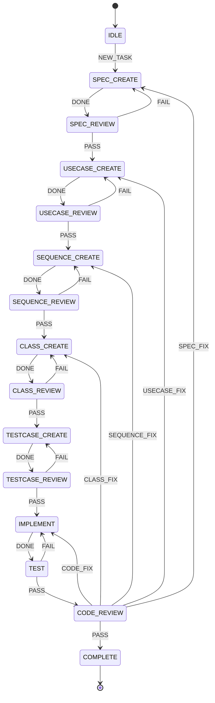

# Agent Controller 設計メモ

## 1. 目的

Agent Controller は、複数の AI エージェントを状態遷移で制御し、ソフトウェア開発工程を継続的・安全に進めるためのコントローラーとする。

AI エージェント自身に工程管理を任せるのではなく、Controller が現在状態・イベント・次状態を明示的に管理する。AI は各状態の処理を担当する交換可能な Worker として扱う。

主な狙いは以下。

- 長時間の AI コーディングでコンテキストが増大し続ける問題を抑える
- 設計・実装・レビューを複数 AI に分担する
- Claude Code / Codex CLI の session limit・token limit で処理が停止しても復旧できるようにする
- PC 変更、CLI 異常終了、AI 利用制限などが発生しても Git の checkpoint から再開できるようにする
- 上流成果物の変更による手戻りを State Machine で明示的に管理する
- QandA.md を介して AI 間の質問・回答・人間への問い合わせを管理する

## 2. 使用技術

- Python
- LangGraph
- Pydantic
- SQLite

LangGraph は状態遷移・Graph 実行の基盤として利用する。
Pydantic は状態・イベント・Worker 応答・設定値などの型と検証に使用する。
SQLite は実行状態、イベント履歴、Worker 状態、retry 情報、checkpoint commit などの永続化に使用する。

## 3. 使用する AI エージェント

初期対応 Worker は以下の 4 種類とする。

1. Claude Code
2. Codex CLI
3. AntiGravity
4. Grok

通常は Claude Code と Codex CLI を優先して使用する。

想定する通常運転例：

- Claude Code が実装、Codex CLI がレビュー
- Codex CLI が実装、Claude Code がレビュー

片方が session limit / token limit / rate limit 等で利用不能になった場合は、利用可能な Claude Code または Codex CLI 単独で実装・レビューを継続できるようにする。

両方とも利用不能の場合は AntiGravity、Grok を fallback Worker として選択可能にする。

例：

```text
Claude + Codex
      ↓ unavailable
Claude only / Codex only
      ↓ unavailable
AntiGravity
      ↓ unavailable
Grok
      ↓ unavailable
WAIT_RESOURCE / HUMAN_REQUIRED
```

Worker の優先順位・対応 Role は設定ファイルから変更可能にする。

## 4. 基本思想

### 4.1 AI は Worker、Controller は決定論的に動作する

AI に「次に何をするか」を自由判断させる範囲を最小化する。

```text
current_state + event -> next_state
```

という状態遷移は Controller が決定する。

AI は指定された State の仕事を実施し、成果物と Event を返す。

例：

```text
IMPLEMENT
  ↓
Codex / Claude
  ↓
DONE / QUESTION / ERROR
  ↓
Controller
```

### 4.2 ドキュメントを AI 間のインターフェースにする

基本的な設計・実装工程は以下を想定する。

```text
SPEC.md
  ↓
USECASE.md
  ↓
SEQUENCE.md
  ↓
CLASS.md
  ↓
TESTCASE.md
  ↓
IMPLEMENT
  ↓
TEST
  ↓
REVIEW
```

各 AI にプロジェクト開始時からの全会話を渡すのではなく、現在の State に必要な成果物だけを Context として渡す。

これにより、コンテキスト増大を抑制する。

## 5. 基本 State

初期案：

```text
IDLE
SPEC_CREATE
SPEC_REVIEW
USECASE_CREATE
USECASE_REVIEW
SEQUENCE_CREATE
SEQUENCE_REVIEW
CLASS_CREATE
CLASS_REVIEW
TESTCASE_CREATE
TESTCASE_REVIEW
IMPLEMENT
TEST
CODE_REVIEW
ANSWER_QUESTION
HUMAN_REQUIRED
WAIT_RESOURCE
COMPLETE
ABORT
```

将来必要に応じて State を追加する。

## 6. 基本状態遷移



## 7. QandA.md

QandA.md はレビュー専用ではなく、全 Worker が利用できる AI 間の質問・回答チャネルとする。

質問を出す可能性がある Worker：

- 設計 AI
- 実装 AI
- テスト AI
- レビュー AI

質問が発生した場合：

```text
WORKING_STATE
    ↓ QUESTION
ANSWER_QUESTION
    ↓ ANSWERED
元の State に戻る
```

回答 AI は既存の設計文書から回答可能か確認する。

回答不能の場合は推測せず HUMAN_REQUIRED に遷移する。

人間回答によって仕様変更が必要になった場合、QandA.md のみに情報を残さず、SPEC.md 等の正式成果物へ反映する。

## 8. 手戻り管理

後工程で上流設計の問題が見つかった場合も、例外扱いせず正式な状態遷移として管理する。

例：

```text
CODE_REVIEW
  ↓ SPEC_FIX
SPEC_CREATE / SPEC_FIX
  ↓
SPEC_REVIEW
  ↓
必要な下流成果物を再生成・再レビュー
```

変更の影響度を分類できるようにする。

```text
CODE_ONLY
CLASS
SEQUENCE
USECASE
SPEC
```

上流成果物変更時には、依存する下流成果物を STALE として扱うことを検討する。

依存関係：

```text
SPEC
 ↓
USECASE
 ↓
SEQUENCE
 ↓
CLASS
 ↓
TESTCASE
 ↓
CODE
```

## 9. Git を checkpoint として利用する

Git commit を State Machine の安全な checkpoint として利用する。

基本ルール：

```text
State 開始
  ↓
開始時 commit SHA を記録
  ↓
AI Worker 実行
  ↓
検証
  ↓
State 成功
  ↓
commit
  ↓
push
  ↓
次 State
```

State 完了時の commit を「その State が正常完了した証拠」とする。

## 10. Token / Session Limit 対策

Claude Code や Codex CLI が以下のような利用制限で突然停止することを前提に設計する。

```text
You've hit your session limit
```

Controller は CLI 出力・終了コード等から resource limit を検出する。

異常終了した場合：

```text
Worker 実行
  ↓
SESSION_LIMIT / RATE_LIMIT
  ↓
現在 State を失敗扱い
  ↓
State 開始時 checkpoint commit まで rollback
  ↓
別 Worker 選択
  ↓
同じ State を最初から再実行
```

重要な設計方針：

**AI に token limit 直前の引き継ぎ文書作成を依存しない。**

突然停止しても Git checkpoint と State DB から安全に再実行できる設計を優先する。

## 11. State の再実行性

各 State は可能な限り以下を満たすようにする。

- State 開始時点の clean な checkpoint から再実行可能
- 同じ入力に対して再実行しても破壊的な副作用を起こさない
- State 途中の成果物は完了扱いにしない
- 成功時のみ commit / push する

長時間 State は将来サブ State 化することも検討する。

## 12. SQLite に保持する情報（案）

例：

```text
project_id
current_state
previous_state
return_state
last_event
active_worker
active_role
checkpoint_commit
retry_count
status
started_at
updated_at
```

その他：

- Event history
- Worker availability
- Worker failure reason
- State execution history
- Q&A status
- Artifact status (VALID / STALE)

## 13. Worker 抽象化

Controller が Claude / Codex / AntiGravity / Grok 固有処理に依存しすぎないよう、共通 Worker インターフェースを定義する。

概念例：

```python
class Worker:
    def available(self) -> bool:
        ...

    def run(self, role, context, instruction):
        ...

    def classify_error(self, result):
        ...
```

Role 例：

```text
SPEC_CREATOR
DESIGNER
IMPLEMENTER
REVIEWER
ANSWERER
```

## 14. Worker 選択

設定例：

```yaml
workers:
  claude:
    roles:
      - design
      - implement
      - review
    priority: 1

  codex:
    roles:
      - implement
      - review
    priority: 1

  antigravity:
    roles:
      - implement
      - review
    priority: 2

  grok:
    roles:
      - review
      - research
    priority: 3
```

初期実装では Claude Code + Codex CLI を優先し、AntiGravity / Grok は fallback とする。

## 15. Review 方針

通常時は可能な限り実装者と Reviewer を別 Worker にする。

```text
Claude IMPLEMENT -> Codex REVIEW
Codex IMPLEMENT  -> Claude REVIEW
```

片方が利用不能の場合は single-agent mode を許可する。

ただし結果には通常レビューと区別できる情報を残す。

例：

```text
PASS
PASS_WITH_SINGLE_AGENT_REVIEW
PASS_WITH_FALLBACK_REVIEW
```

## 16. Controller が AI である必要はない

工程制御、retry、rollback、Worker 切替は Python / LangGraph の決定論的処理として実装する。

AI を使用するのは、設計判断、実装、レビュー、Q&A 回答など意味理解が必要な部分に限定する。

```text
工程判断 -> Controller
内容判断 -> AI Worker
```

この責務分離を基本原則とする。

## 17. 最初の実装範囲

最初からすべてを作らず、以下の MVP を目標とする。

1. Python プロジェクト作成
2. Pydantic による State / Event モデル
3. SQLite 永続化
4. LangGraph による基本状態遷移
5. Claude Code Worker
6. Codex CLI Worker
7. Worker availability / error classification
8. Git checkpoint commit 管理
9. session limit 検出
10. rollback + Worker fallback
11. SPEC -> IMPLEMENT -> REVIEW 程度の小さな実証フロー

その後、USECASE / SEQUENCE / CLASS / TESTCASE / QandA / AntiGravity / Grok を段階的に追加する。

## 18. 今後検討すること

- Claude Code / Codex CLI の resource limit 検出方法
- 各 CLI の subprocess 実行方式
- CLI ごとの終了コード・エラーメッセージ分類
- Windows / Linux / WSL での差異
- worktree を State ごとに分離するか
- rollback 時の untracked file の扱い
- AI が勝手に commit した場合の扱い
- State ごとの timeout
- retry 上限
- Human in the Loop の UI / CLI
- 複数プロジェクト同時実行
- Worker の並列実行
- ログと実行トレースの可視化
- LangGraph の checkpoint 機能と独自 SQLite 状態管理の責務分担

## 19. 最終的なイメージ

```text
                  +------------------+
                  | Agent Controller |
                  |   State Machine  |
                  +---------+--------+
                            |
                  State / Role / Input
                            |
          +-----------------+-----------------+
          |                 |                 |
          v                 v                 v
      Claude Code       Codex CLI       Fallback Worker
                                           |
                                  AntiGravity / Grok
          |                 |                 |
          +-----------------+-----------------+
                            |
                 Artifact / QandA / Event
                            |
                            v
                  +------------------+
                  |   Controller     |
                  +--------+---------+
                           |
                    Git checkpoint
                    SQLite state
                           |
                           v
                       Next State
```

Agent Controller が継続性を持ち、AI Worker は交換可能とする。

AI が停止しても開発工程そのものは停止しない構造を目指す。
