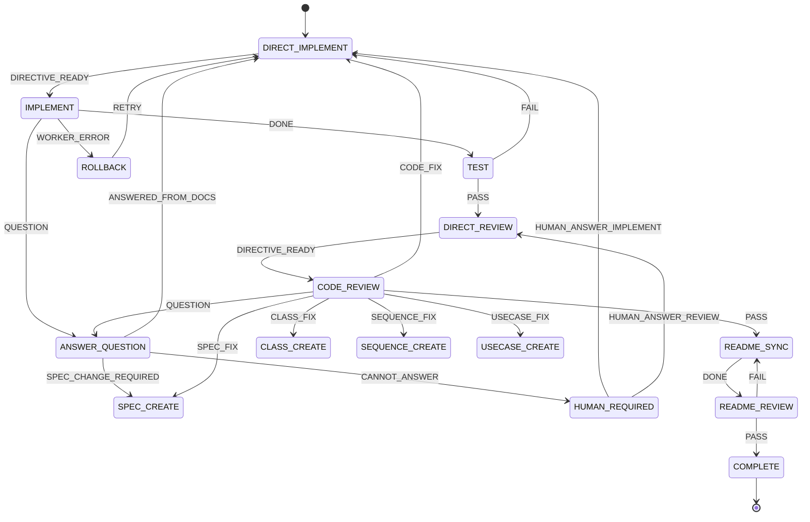

# Agent Controller 設計メモ

## 1. 目的

Agent Controller は、複数の AI エージェントを状態遷移で制御し、ソフトウェア開発工程を継続的・安全に進めるためのコントローラーとする。

AI エージェント自身に工程管理を任せるのではなく、Controller が現在状態・イベント・次状態を明示的に管理する。AI は各状態の処理を担当する交換可能な Worker として扱う。

主な狙いは以下。

- 長時間の AI コーディングでコンテキストが増大し続ける問題を抑える
- 設計・実装・レビューを複数 AI に分担する
- Claude Code / Codex CLI の session limit・token limit で処理が停止しても復旧できるようにする
- PC 変更、CLI 異常終了、AI 利用制限などが発生しても Git の checkpoint から再開できるようにする
- 上流成果物の変更による手戻りを State Machine で明示的に管理する
- QandA.md を介して AI 間の質問・回答・人間への問い合わせを管理する
- 人間が ChatGPT と相談し、その内容を CLI AI へ手作業で転記する作業を可能な限り廃止する

## 2. 使用技術

- Python
- LangGraph
- Pydantic
- SQLite

LangGraph は状態遷移・Graph 実行の基盤として利用する。
Pydantic は状態・イベント・Worker 応答・設定値などの型と検証に使用する。
SQLite は実行状態、イベント履歴、Worker 状態、retry 情報、checkpoint commit などの永続化に使用する。

## 3. 使用する AI エージェント

初期対応 Worker は以下の 4 種類とする。

1. Claude Code
2. Codex CLI
3. AntiGravity
4. Grok

通常は Claude Code と Codex CLI を優先して使用する。

想定する通常運転例：

- Claude Code が実装、Codex CLI がレビュー
- Codex CLI が実装、Claude Code がレビュー

片方が session limit / token limit / rate limit 等で利用不能になった場合は、利用可能な Claude Code または Codex CLI 単独で実装・レビューを継続できるようにする。

両方とも利用不能の場合は AntiGravity、Grok を fallback Worker として選択可能にする。

## 4. 基本思想

### 4.1 AI は Worker、Controller は決定論的に動作する

AI に「次に何をするか」を自由判断させる範囲を最小化する。

```text
current_state + event -> next_state
```

という状態遷移は Controller が決定する。
AI は指定された State の仕事を実施し、成果物と Event を返す。

### 4.2 ドキュメントを AI 間のインターフェースにする

基本的な設計・実装工程は以下を想定する。

```text
SPEC.md
  ↓
USECASE.md
  ↓
SEQUENCE.md
  ↓
CLASS.md
  ↓
TESTCASE.md
  ↓
IMPLEMENT
  ↓
TEST
  ↓
REVIEW
```

各 AI にプロジェクト開始時からの全会話を渡すのではなく、現在の State に必要な成果物だけを Context として渡す。
これにより、コンテキスト増大を抑制する。

## 5. 役割モデル

Agent Controller では、少なくとも以下の論理 Role を分離する。

- DIRECTOR: 上位仕様と成果物を読み、実装・修正・レビュー継続の指示を作る指揮者 AI
- IMPLEMENTER: Director の指示と設計成果物に従って実装する AI
- REVIEWER: 実装成果物を独立にレビューする AI
- ANSWERER: QandA.md の質問を既存成果物から解決する AI。初期実装では DIRECTOR が兼任してよい
- CONTROLLER: AI ではなく Python / LangGraph で実装する決定論的な工程制御

DIRECTOR と CONTROLLER は分離する。
Controller は「次にどの State へ進むか」を決め、Director は「何を実装・修正すべきか」という意味判断を担当する。

## 6. 人間→ChatGPT→CLI AI の手作業転記を自動化する中心ループ

Agent Controller の重要な目的は、これまで人間が ChatGPT と相談し、その回答を Claude Code / Codex CLI へ貼り付けていた往復を自動化することである。

基本フロー：

```text
上位仕様・成果物
      ↓
DIRECTOR
      ↓ 実装指示
IMPLEMENTER
      ↓
  ┌───┴───────────────┐
  │                   │
実装完了             QUESTION
  │                   │
  │               QandA.md
  │                   ↓
  │                DIRECTOR
  │                   ↓ 回答・追加指示
  │               IMPLEMENTER
  │                   │
  └───────────┬───────┘
              ↓
           REVIEWER
              │
      ┌───────┴────────┐
      │                │
     PASS            QUESTION / FAIL
      │                │
      │             QandA.md
      │                ↓
      │             DIRECTOR
      │                ↓ 回答・修正指示
      │            IMPLEMENTER
      │                │
      └────────────────┘
              ↓
           COMPLETE
```

このループにより、人間は通常時に Agent 間のメッセージを仲介しない。

## 7. Director の責務

DIRECTOR は各工程の上位成果物を読み、IMPLEMENTER / REVIEWER へ具体的な作業指示を生成する。

例：IMPLEMENT State では、Director は以下を読む。

- SPEC.md
- USECASE.md
- SEQUENCE.md
- CLASS.md
- TESTCASE.md
- QandA.md の未解決・最新回答
- 必要に応じて最新 diff / test result

Director の出力は自由会話ではなく、実装 AI がそのまま実行できる指示として保存する。

候補ファイル：

```text
DIRECTIVE.md
```

または State ごとの命令ファイルとして管理する。

DIRECTIVE.md には少なくとも以下を含める。

```text
目的
対象 State
参照すべき成果物
実施すべき変更
変更してはいけない範囲
完了条件
テスト条件
質問が必要な場合の QandA.md 書式
```

## 8. Implementer の責務

IMPLEMENTER は上位仕様から直接勝手に工程判断するのではなく、Director の指示と正式成果物に従って作業する。

通常終了時：

```text
IMPLEMENTER
  ↓
変更
  ↓
テスト可能なら実行
  ↓
RESULT / DONE event
```

判断不能時：

```text
IMPLEMENTER
  ↓
QandA.md に質問追加
  ↓
QUESTION event
```

Implementer は仕様の空白を推測で埋めない。

## 9. Reviewer の責務

REVIEWER は Implementer と可能な限り別 Worker を使用する。

Reviewer は以下を確認する。

- 上位仕様への適合
- 設計成果物との整合
- TESTCASE.md への適合
- 実装品質
- 回帰リスク
- README.md 等の文書更新漏れ

問題が明確なら FAIL / 修正分類を返す。
判断や仕様確認が必要なら QandA.md に質問を書く。

```text
REVIEWER
  ↓
QandA.md
  ↓ QUESTION
DIRECTOR
```

## 10. QandA.md を Agent 間の共通問い合わせチャネルにする

QandA.md はレビュー専用ではなく、Implementer / Reviewer / Designer 等すべての Worker が利用可能とする。

1 件ごとに最低限以下を持つ。

```text
Question ID
Questioner Role
Questioner Worker
Current State
Question
Reason / Context
Status: OPEN / ANSWERED / HUMAN_REQUIRED
Answer
Answered By
Related Artifacts
```

Q&A 処理：

```text
WORKING_STATE
    ↓ QUESTION
ANSWER_QUESTION
    ↓
DIRECTOR / ANSWERER
    ├─ 既存成果物から回答可能 → QandA.md 更新 → 元 State
    ├─ 上位成果物修正が必要 → SPEC_FIX 等へ遷移
    └─ 判断不能 → HUMAN_REQUIRED
```

回答後は Controller が元の State と質問元 Role を保持しておき、適切な Worker に再度指示する。

例：

```text
IMPLEMENT → QUESTION → DIRECTOR_ANSWER → IMPLEMENT
REVIEW    → QUESTION → DIRECTOR_ANSWER → IMPLEMENT → REVIEW
```

Reviewer の質問に対して Director が「コード修正が必要」と判断した場合は、直接 Reviewer に返すのではなく Implementer に修正指示を出し、修正完了後に Reviewer を再実行する。

## 11. 基本 State

初期案：

```text
IDLE
SPEC_CREATE
SPEC_REVIEW
USECASE_CREATE
USECASE_REVIEW
SEQUENCE_CREATE
SEQUENCE_REVIEW
CLASS_CREATE
CLASS_REVIEW
TESTCASE_CREATE
TESTCASE_REVIEW
DIRECT
IMPLEMENT
TEST
CODE_REVIEW
ANSWER_QUESTION
README_SYNC
README_REVIEW
HUMAN_REQUIRED
WAIT_RESOURCE
COMPLETE
ABORT
```

DIRECT は Director が次 Worker 向けの指示を生成する State とする。
実装の都合により各工程専用 DIRECT State に分割してもよい。

## 12. 実装・レビュー・Q&A の状態遷移



実際には ANSWER_QUESTION State に return_state / question_source_state / resume_role を保持し、回答後の戻り先を動的に決定する。

## 13. 手戻り管理

後工程で上流設計の問題が見つかった場合も、例外扱いせず正式な状態遷移として管理する。

変更の影響度：

```text
CODE_ONLY
CLASS
SEQUENCE
USECASE
SPEC
```

依存関係：

```text
SPEC
 ↓
USECASE
 ↓
SEQUENCE
 ↓
CLASS
 ↓
TESTCASE
 ↓
CODE
 ↓
README
```

上流成果物変更時には依存する下流成果物を STALE とする。
SPEC レベルの変更時は README_SYNC を必須とする。

## 14. Git を checkpoint として利用する

Git commit を State Machine の安全な checkpoint として利用する。

```text
State 開始
  ↓
開始時 commit SHA を記録
  ↓
AI Worker 実行
  ↓
検証
  ↓
State 成功
  ↓
commit
  ↓
push
  ↓
次 State
```

State 完了時の commit を「その State が正常完了した証拠」とする。

## 15. Token / Session Limit 対策

Claude Code や Codex CLI の利用制限による突然停止を前提にする。

```text
SESSION_LIMIT / RATE_LIMIT
  ↓
現在 State 失敗
  ↓
State 開始時 checkpoint commit へ rollback
  ↓
別 Worker を選択
  ↓
Director が同じ目的の指示を再生成または再利用
  ↓
同じ State を再実行
```

AI に token limit 直前の引き継ぎ作成を依存しない。

## 16. Worker 抽象化

Controller が Claude / Codex / AntiGravity / Grok 固有処理に依存しすぎないよう共通 Worker Interface を定義する。

Role 例：

```text
DIRECTOR
IMPLEMENTER
REVIEWER
ANSWERER
SPEC_CREATOR
DESIGNER
```

通常時：

```text
Claude IMPLEMENTER → Codex REVIEWER
Codex IMPLEMENTER  → Claude REVIEWER
```

片方が利用不能なら single-agent mode を許可するが、結果に品質モードを残す。

## 17. 状態遷移ログ

人間が最初に確認するログとして、全ての状態遷移を記録する。

必須情報：

```text
timestamp
run_id
from_state
event
to_state
role
worker
reason
retry_count
checkpoint_commit
```

人間向け表示例：

```text
16:21:03 | TEST        | TEST_FAIL     | IMPLEMENT   | pytest | retry=1
16:27:41 | IMPLEMENT   | SESSION_LIMIT | IMPLEMENT   | claude | rollback=abc1234
16:27:43 | IMPLEMENT   | WORKER_SWITCH | IMPLEMENT   | codex  | reason=claude_session_limit
16:31:10 | CODE_REVIEW | SPEC_FIX      | SPEC_CREATE | codex  | reason=requirement_ambiguity
```

SQLite の Event History を正本とし、人間向けテキストログを生成可能にする。

## 18. 無限ループ防止

AI を自律運転させる以上、同一 State 間を無限に往復しないための Guard を Controller に必須実装する。

最低限：

- State ごとの retry 上限
- 同一 from_state + event + to_state の連続回数上限
- 1 run あたりの最大 state transition 数
- 同一 Q&A の再発検出
- 同じ test failure / review finding が繰り返される NO_PROGRESS 検出
- Worker を変更しても同一失敗が続く場合は HUMAN_REQUIRED
- 同じ理由で SPEC まで複数回戻る場合は LOOP_DETECTED → HUMAN_REQUIRED

AI 自身に「無限ループかどうか」を最終判断させず、Controller が機械的上限を持つ。

## 19. README.md 同期

README.md は更新漏れしやすいため正式な成果物として扱う。

特に以下では README_SYNC を必須とする。

- SPEC_CHANGE
- USECASE_CHANGE
- 公開 API / CLI 変更
- インストール方法変更
- 設定方法変更
- ユーザー向け挙動変更

README_SYNC → README_REVIEW を通過してから COMPLETE とする。

## 20. COMPLETE 条件

COMPLETE は単にコードレビューが PASS した状態ではない。

最低条件：

```text
SPEC latest
USECASE latest
SEQUENCE latest
CLASS latest
TESTCASE latest
CODE latest
README latest
TEST PASS
REVIEW PASS
QandA OPEN = 0
working tree clean
commit済み
push済み
```

## 21. SQLite に保持する情報

候補：

```text
project_id
run_id
current_state
previous_state
return_state
question_source_state
resume_role
last_event
active_worker
active_role
checkpoint_commit
retry_count
transition_count
status
started_at
updated_at
```

その他：

- Event history
- Worker availability
- Worker failure reason
- State execution history
- Q&A status
- Artifact status (VALID / STALE)
- Directive history
- Review cycle count
- No-progress fingerprint

## 22. MVP

最初の実証では全工程を一気に作らず、今回最も重要な「人間による ChatGPT→CLI AI 転記の削減」を先に検証する。

MVP Flow：

```text
既存 SPEC.md
    ↓
DIRECTOR
    ↓ DIRECTIVE.md
IMPLEMENTER (Claude or Codex)
    ├─ QUESTION → QandA.md → DIRECTOR → IMPLEMENTER
    └─ DONE
          ↓
        TEST
          ↓
       REVIEWER (別 AI)
          ├─ QUESTION → QandA.md → DIRECTOR → IMPLEMENTER → REVIEWER
          ├─ FAIL     → DIRECTOR → IMPLEMENTER → REVIEWER
          └─ PASS
               ↓
           README_SYNC
               ↓
           COMPLETE
```

このループが人間介入なしで最低 1 回完走することを最初の成功条件とする。

## 23. 最終的なイメージ

```text
                        +------------------+
                        | Agent Controller |
                        | State / Event DB |
                        +--------+---------+
                                 |
                                 v
                        +------------------+
                        |    DIRECTOR      |
                        | 意味判断・指示生成 |
                        +--------+---------+
                                 |
                            DIRECTIVE.md
                                 |
                    +------------+-------------+
                    |                          |
                    v                          v
              +-------------+            +-------------+
              | IMPLEMENTER |            |  REVIEWER   |
              +------+------+            +------+------+
                     |                          |
                     +----------+  +------------+
                                |  |
                                v  v
                              QandA.md
                                |
                                v
                             DIRECTOR
                                |
                       回答 / 修正指示
                                |
                                v
                         IMPLEMENTER / REVIEWER
                                |
                                v
                       Git checkpoint + push
                                |
                                v
                           Next State
```

Agent Controller が継続性を持ち、AI Worker は交換可能とする。
人間は通常の Agent 間メッセージ交換から外れ、既存成果物から回答不能な要求判断や最終評価など、本当に人間が必要な箇所だけに介入する構造を目指す。
